# Week 1 RAG Architecture

## System Overview


## Components

### DocumentIngester (`ingestion.py`)

Loads and chunks documents for the RAG pipeline.

| Method | Description |
|--------|-------------|
| `load_from_file(path)` | Load text content from file |
| `chunk(documents)` | Split into overlapping chunks (512 chars, 50 overlap) |
| `ingest(path)` | Full pipeline: load → chunk → structure with metadata |

**Output**: List of `{id, text, source, chunk_index}`

### RAGRetriever (`retrieval.py`)

Manages embeddings and vector similarity search.

| Method | Description |
|--------|-------------|
| `embed(texts)` | Generate embeddings via OpenAI API (with caching) |
| `index(documents)` | Store documents and their embeddings |
| `retrieve(query, top_k)` | Find most similar chunks using cosine similarity |

**Vector Store**: In-memory dict (Week 1) → Weaviate (Week 2)

### RAGGenerator (`generation.py`)

Generates answers using retrieved context.

| Method | Description |
|--------|-------------|
| `generate(query, context)` | Call LLM with formatted prompt |
| `rag_answer(query, retriever)` | Full RAG: retrieve → generate → return |

**Prompt Template**: Includes context grounding to reduce hallucination.

### FastAPI Server (`main.py`)

HTTP API exposing the RAG pipeline.

| Endpoint | Method | Description |
|----------|--------|-------------|
| `/health` | GET | Health check |
| `/ingest` | POST | Ingest documents |
| `/query` | POST | Query the RAG system |

## Data Flow Example

```
Query: "What is RAG?"
    ↓
1. Embed query → [0.12, -0.34, 0.56, ...] (1536 dims)
    ↓
2. Search vector store → Find top-3 similar chunks
    ↓
3. Retrieved chunks:
   - Chunk 0: "RAG is a technique..." (score: 0.89)
   - Chunk 1: "RAG benefits include..." (score: 0.82)
   - Chunk 2: "How RAG Works..." (score: 0.78)
    ↓
4. Format prompt with context + query
    ↓
5. Call GPT-3.5-turbo
    ↓
6. Return: {answer, sources, latency_ms}
```

## Entity Relationships

```mermaid
erDiagram
    Document ||--o{ Chunk : contains
    Chunk ||--|| Embedding : has
    Query ||--|| Embedding : generates
    Query ||--o{ RetrievalResult : produces
    RetrievalResult }o--|| Chunk : references
    Query ||--|| Answer : generates
    Answer }o--o{ RetrievalResult : cites
    
    Document {
        string path
        string content
        datetime ingested_at
    }
    
    Chunk {
        string id
        string text
        string source
        int chunk_index
    }
    
    Embedding {
        float[] vector
        int dimensions
    }
    
    Query {
        string text
        int top_k
    }
    
    RetrievalResult {
        string chunk_id
        float similarity_score
    }
    
    Answer {
        string text
        string[] sources
        float latency_ms
    }
```



## Latency Breakdown

| Stage | Typical Latency | Notes |
|-------|-----------------|-------|
| Ingestion | <100ms per doc | Local file I/O + chunking |
| Embedding | 50-200ms | OpenAI API call (cached after first) |
| Retrieval | <10ms | In-memory cosine similarity |
| Generation | 500-2000ms | LLM API call (GPT-3.5-turbo) |
| **Total E2E** | **600-2500ms** | Query → Answer |

## Configuration

Environment variables (`.env`):

```bash
OPENAI_API_KEY=sk-...         # Required
EMBEDDING_MODEL=text-embedding-3-small
LLM_MODEL=gpt-3.5-turbo
LLM_TEMPERATURE=0.7
CHUNK_SIZE=512
CHUNK_OVERLAP=50
TOP_K_RETRIEVAL=3
```
